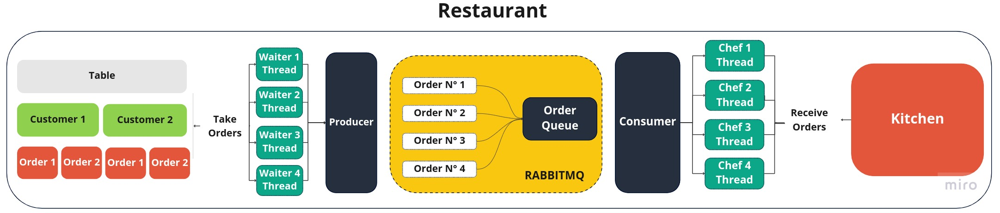

## Concurrency in Python
This project was developed to simulate concurrency with a message queue, using a clear analogy with a restaurant.

## Structure

The structure of the project consists of consumers and producers, responsible for ensuring concurrency in the message queue.

  

- **Producer:** Producers are like our waiters, walking around the restaurant and taking orders from tables. They also work concurrently.
- **Consumer:** Consumers, represented by our chefs in the kitchen, work concurrently and wait for new orders from customers.

Chef and Waiter are Threads responsible for concurrency.

- Chef (`Threads`)
- Waiter (`Threads`)

## Getting Started

To start the application, simply run the command `docker-compose up`. 
You can also monitor the execution in the container logs.

- `Producer: docker logs producer -f`
- `Consumer: docker logs consumer -f`

If you wish, you can also view the messages directly through the RabbitMQ dashboard.

The `RabbitMQ` dashboard is available through port `15672`, accessible at the address `http://localhost:15672/`. The default username and password to access the dashboard are `rabbitmq` and `rabbitmq` .

## Additional Information

The project was developed in `Python` and uses `RabbitMQ` as a message broker.
