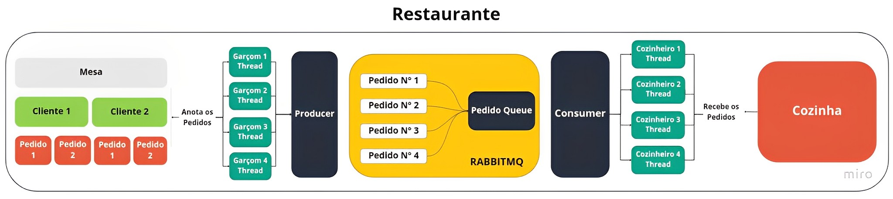

## Concorrência em Python
Esse projeto foi desenvolvido para simular concorrência com uma fila de mensagens, utilizando uma analogia clara com um restaurante.

## Estrutura

A estrutura do projeto é composta por consumidores e produtores, responsáveis por garantir a concorrência na fila de mensagens.

  

- **Producer:** Os consumidores são nossos cozinheiros na cozinha, trabalhando de forma concorrente e aguardando por novos pedidos.
- **Consumer:** Os consumidores, representados pelos nossos cozinheiros na cozinha, trabalham de forma concorrente e ficam aguardando por novos pedidos dos clientes.

Cozinhore e Garçom são Threads responsáveis pela concorrência.

- Cozinheiro (`Threads`)
- Garçom (`Threads`)

## Como começar?

Para iniciar a aplicação, basta executar o comando `docker-compose up`. 
Você também pode acompanhar as execuções nos logs dos containers.

- `Producer: docker logs producer -f`
- `Consumer: docker logs consumer -f`

Se desejar, é possível visualizar as mensagens diretamente pelo painel do RabbitMQ.

O painel do `RabbitMQ` está disponível através da porta `15672`, acessível pelo endereço `http://localhost:15672/`. O usuário e senha padrão para acessar o painel são `rabbitmq` e `rabbitmq`, respectivamente.

## Informações adicionais

O projeto foi desenvolvido em `Python` e utiliza o `RabbitMQ` como Broker de mensagens.
